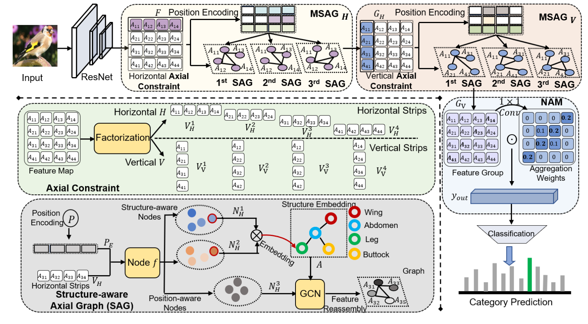

# SRGN

## Framework

## Requirement
python 3.6

PyTorch >= 1.3.1

torchvision >= 0.4.2

## Dataset 
Download the CUB-200-2011 datasets and put it in the root directory named bird, You can also try other fine-grained datasets.

## Train
Train from scratch with train.py.
